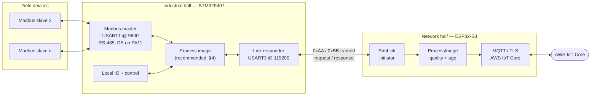

# IIoT gateway: two-chip architecture

Design notes for the STM32F407 + ESP32-S3 split used by `ModbusRTU_AWS`
(industrial half) and `IoTHandler` (network half).

---

## 1. The split is the right call

Two MCUs is more BOM than one, and it buys three things that matter in an
industrial gateway:

- **Failure isolation.** WiFi association, TLS handshakes, DNS and MQTT
  reconnects are unbounded in time and occasionally fatal. None of that can be
  allowed near a control loop. With the radio on its own die, an ESP32 panic or
  reboot is invisible to the process.
- **Certification and lifetime.** The industrial half has no radio, no TLS stack
  and no OTA surface. Its firmware can stay small enough to review and stable
  enough to leave alone for years, while the connectivity half changes whenever
  a cloud SDK or CA does.
- **Isolation domains.** RS-485 and field IO usually sit in a different, noisier,
  sometimes mains-referenced electrical domain. A single narrow digital link
  between the halves is the cheapest place to put a barrier.

The cost is that the link between them becomes a real interface with real
failure modes. The rest of this document is about getting that interface right.

---

## 2. Transport: UART, not SPI

| | UART | SPI |
|---|---|---|
| Wires | 2 + GND | 4–6 + GND |
| Peer symmetry | either side may speak first | slave physically cannot initiate |
| Throughput | ~1 KB in 11 ms at 921600 | 10–40 Mbit/s |
| Clock accuracy | both sides need a crystal (both have one) | none needed |
| STM32 slave role | trivial (DMA + IDLE line) | fiddly: NSS handling, DMA restart, byte slip on a missed edge |
| ESP32 slave role | trivial | needs ESP-IDF SPI-slave, no clean Arduino API |
| Isolation | 2 cheap digital isolator channels | 4+ channels, speed-limited by propagation delay |
| Debugging | any USB-serial adapter taps it live | logic analyser, harder to interpret |

**Take UART.** The deciding factor is that the bandwidth argument for SPI does not
apply to this workload. Process data is small: 500 registers is 1 KB, which at
921600 baud is 11 ms. Even a 100 ms scan cycle leaves the link 90 % idle. You
would be paying SPI's complexity — a rigid master/slave hardware relationship, an
extra attention line to get around it, twice the isolation channels, and a much
harder bring-up — to solve a problem you do not have.

SPI earns its keep only if you later stream something genuinely wide: raw
waveform capture, vibration or power-quality sampling, camera frames, or pushing
firmware images across at MB/s. If that appears, add SPI **alongside** the UART
for bulk transfer and keep the UART as the control channel. Do not replace it.

Practical settings:

- 8N1, no parity. The frame CRC is stronger than a parity bit and you already
  have it.
- **115200 today** because that is what the STM32's `huart3` is configured for.
  Raise both sides together to 460800 or 921600 once the link is proven; the
  STM32F407's USART1/3 and the ESP32-S3 both reach several Mbit/s comfortably.
- Hardware RTS/CTS is optional and, with a correct request/response protocol and
  adequate buffers, unnecessary. Wire the pins anyway if the connector has room —
  it costs nothing now and is impossible to add later.
- On the STM32, drive the link with **DMA plus IDLE-line detection**. The `.ioc`
  already configures circular DMA on USART3 RX (DMA1 Stream1) and normal DMA on
  TX (Stream3), and `HAL_UART_MspInit` already calls `__HAL_LINKDMA`. None of it
  is used — every transfer in the current firmware is a blocking
  `HAL_UART_Transmit`/`HAL_UART_Receive`. Switching to DMA needs no CubeMX change,
  only application code, and it removes the byte-loss window described in §5.

---

## 3. Direction of control: ESP32 initiates, STM32 responds

This is what the existing firmware already does, and it is correct. Worth being
explicit about why, because the intuition often runs the other way — "the STM32
has the data, so it should send it".

**The data owner should answer, not push.**

1. **Availability is asymmetric.** The ESP32 is unavailable at unpredictable
   times: WiFi roaming, TLS renegotiation, backoff after a broker refusal, OTA.
   If the STM32 pushed, it would have to buffer and retry into a peer that
   vanishes without warning — reimplementing a persistent queue on the
   resource-constrained, control-relevant side. As a responder its worst-case
   obligation is one reply, bounded and known.
2. **Only the network side knows the right rate.** Publish interval, shadow
   policy, backoff state, whether the uplink is up at all — all of that lives on
   the ESP32. The side that knows what it can ship should be the side that asks.
3. **The control loop must never block on the radio.** A responder cannot be
   made to wait on a stalled peer. A pusher can.
4. **Recovery direction.** If the ESP32 wedges, the STM32 keeps controlling the
   process and simply gets no requests. That is exactly the degradation you want.
   Invert the roles and an ESP32 hang stalls STM32 transmit paths.

So the STM32 wears two hats, and that is fine: **master** on RS-485 towards the
field devices, **slave** on the inter-chip UART towards the ESP32.

### Side-band GPIOs worth wiring

Two wires that cost nothing at layout time and are impossible to retrofit:

- **`STM_EVENT`, STM32 → ESP32.** "I have something that should not wait for your
  next poll." Alarm, digital input transition, latched fault. Lets you keep a
  strict single-initiator protocol *and* get millisecond alarm latency without
  polling fast. `IoTHandler` already supports it: set `PIN_STM_EVENT` and the ISR
  notifies the link task, which polls immediately. The current STM32 firmware
  does not drive it yet.
- **`ESP_EN` / `ESP_BOOT`, STM32 → ESP32.** Lets the control side power-cycle or
  re-flash the radio side through the ESP ROM bootloader. In the field this makes
  the STM32 the recovery path for a bricked OTA — genuinely valuable, and the
  reason to prefer this direction over an ESP32-drives-STM32-NRST arrangement.

---

## 4. The change that matters most: a process image on the STM32

Everything above is already how the system is built. This is the one structural
thing to change, and it is on the STM32 side.

**Today** `ESP32MsgHandler_Task()` handles an inbound request by synchronously
running a Modbus transaction on RS-485
(`esp32msghandler.c:47` → `Modbus_ReadInputRegisters` → `Modbus_SendRequest`,
which blocks on `HAL_MAX_DELAY` transmit and a 1000 ms receive timeout). The link
is a thin synchronous proxy for the field bus. Consequences:

- ESP32 request latency equals field-bus latency. One unresponsive slave costs
  1.6 s per affected tag, every scan.
- The link's timeout budget is dictated by the slowest field device.
- While a Modbus transaction is in flight the STM32 is not reading USART3 at all,
  so any ESP32 byte arriving in that window is lost (§5).
- Nothing else can run on the STM32 during a request — no control, no local IO
  logic — because it is all one blocking call chain in `main()`.

**Instead** decouple with a RAM process image, the model every real PLC and
OPC-UA gateway uses:

1. A free-running scanner walks a configured poll list on RS-485 at its own pace
   and writes each result into a RAM table along with a timestamp and a quality
   flag.
2. An ESP32 read is answered **from the table** — microseconds, deterministic,
   never touches the field bus.
3. An ESP32 write is appended to a small pending-write FIFO and acknowledged as
   *accepted*; the scanner executes it on its next pass and records the outcome
   in the table, which the ESP32 sees on a later read. Offer a synchronous
   variant with an explicit timeout only for setpoints that need in-band
   confirmation.

What this buys:

- Link replies become fast and bounded, so `STM_RSP_TIMEOUT_MS` can drop from
  1600 ms to ~50 ms and the poll rate stops being hostage to the field bus.
- Quality and age become **real**, transmitted values instead of something the
  ESP32 has to infer from timestamps — which is the only fix for quirk Q5, where
  a failed Modbus read is currently reported to the cloud as `STATUS_OK` with
  stale bytes. That is the most serious defect in the current design: it silently
  publishes wrong data.
- The register-class confusion (Q1) and the byte-vs-register count muddle (Q2/Q3)
  disappear, because the link protocol stops being a Modbus proxy and becomes
  "give me N bytes from process-image offset X". Simpler, faster, and it makes
  block reads safe — no more over-fetching 2N registers to return N.
- The STM32 regains a main loop that can do control work.

Then set `STM_FW_QUIRKS 0` in `IoTHandler/include/config.h` and the client-side
workarounds compile out.

### Other STM32-side fixes, roughly in priority order

1. Report the real Modbus status in the response instead of always `STATUS_OK`
   (Q5). Highest value per line changed — it is a data-integrity bug.
2. Bounds-check `rxIndex` against `ESP32MSG_BUFFER_SIZE`; a frame claiming
   `count > 56` overflows a 64-byte buffer today (Q8).
3. Reset `rxIndex` on the `MULREAD` failure path (Q4) and add an inter-frame
   idle timeout so a truncated frame cannot wedge the parser.
4. Un-swap holding/input in `ESP32MsgHandler_ReadRegister` (Q1) and fix the
   index arithmetic in `ESP32MsgHandler_MultipleReadRegister` (Q2/Q3).
5. Move USART3 to DMA + IDLE-line detection (§5).
6. Check the Modbus exception bit — `MODBUS_EXCEPTION_MASK` is defined and never
   used, so a slave exception surfaces as a timeout or CRC error.

---

## 5. Failure modes and expected behaviour

| Failure | Now | After §4 |
|---|---|---|
| ESP32 reboots / WiFi down | STM32 unaffected, keeps polling RS-485 | same |
| STM32 reboots | ESP32 tags go `stale` then `commFail`, LED red, retries forever | same |
| One RS-485 slave dead | 1.6 s stall per affected tag, every scan | that tag goes bad quality, scan rate unaffected |
| Slave returns a Modbus exception | reported as timeout or CRC error | reported as bad quality |
| Slave times out | **cloud gets `STATUS_OK` with stale data** | bad quality, correctly reported |
| ESP32 sends during an RS-485 transaction | bytes lost — USART3 is not being read | absorbed by DMA |
| Link byte corrupted | CRC fails, `BB 01 00` or timeout, ESP32 retries 3× | same |
| Truncated request frame | STM32 parser holds it until a later CRC failure clears it | idle timeout clears it |
| MQTT broker unreachable | polling continues into the cache, publishes resume on reconnect | same |

The byte-loss row is worth dwelling on. The STM32 currently services USART3 with
`HAL_UART_Receive(esp32_uart, &byte, 1, 0)` in a tight loop from `main()`. During
a blocking Modbus transaction that loop is not running, the F407 USART has a
one-byte hardware buffer, and the overrun flag sets. It mostly self-heals — the
next `HAL_UART_Receive` reads `DR` and clears `ORE` — but bytes are gone. This is
why the ESP32 must never pipeline requests, and it is the second-best reason to
move to DMA after the latency argument.

---

## 6. Suggested order of work

1. **Prove the link.** `pio run -e linktest` on the ESP32 against the STM32 as it
   is. The vectors in `IoTHandler/README.md` let you verify each command by hand
   from a terminal first.
2. **Fix Q5 on the STM32** (report the real status). Small change, removes the
   silent-bad-data failure.
3. **Bring up the cloud path.** Certificates, `secrets.h`, full environment.
4. **Fix Q8, Q4, Q1, Q2/Q3** — buffer bounds, parser reset, register semantics.
5. **Refactor the STM32 to a process image** (§4), move USART3 to DMA, then set
   `STM_FW_QUIRKS 0`.
6. **Raise the link baud** to 460800+ on both sides, and drop
   `STM_RSP_TIMEOUT_MS`.
7. Only then consider SPI, and only if a genuinely wide data stream appears.
